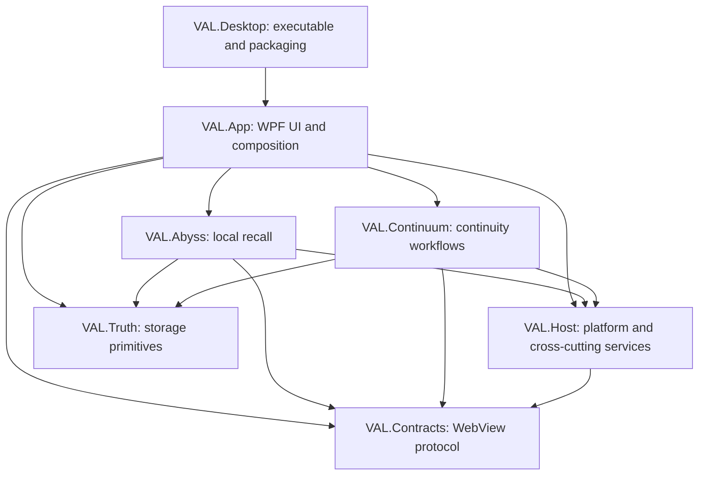

# Architecture

## Project Boundaries

The executable is a leaf composition project. Tests reference the assemblies they exercise and never reference the executable. Architecture tests reject project-reference cycles and changes to the desktop boundary.

## Runtime Model

1. `VAL.Desktop` starts `ValDesktopBootstrapper`.
2. `VAL.App` builds the dependency injection host and registers UI, feature, and platform services.
3. `HostCommandRouter` validates and dispatches WebView messages through registered command contributors.
4. Feature runtimes coordinate domain services; Continuum delegates Pulse and Chronicle to isolated lifecycle workflows.
5. `IBackgroundTaskSupervisor` owns non-UI background work, observes failures, and drains work during bounded shutdown.
6. `ITruthStore` and atomic file helpers protect conversation data and rebuild operations.

## Rules

- Put wire names and shared message contracts in `VAL.Contracts`.
- Put operating-system, logging, path, security, and WebView abstractions in `VAL.Host`.
- Put WPF windows, view models, application composition, and desktop lifecycle in `VAL.App`.
- Keep feature behavior in its feature assembly; do not make features depend on `VAL.App` or `VAL.Desktop`.
- Keep persistence writes atomic and cancellation-aware.
- Do not use unobserved fire-and-forget tasks. Schedule background work through `IBackgroundTaskSupervisor` or own and await a documented lifecycle task.
- Do not launch processes directly from feature code. Use `IProcessLauncher`.
- Add a canonical command contract before introducing a new JavaScript-to-host command.
- Maintain locked package restores and treat compiler, analyzer, and audit warnings as build failures.

## Quality Gates

`VAL.sln` is the authoritative build surface. CI verifies formatting, locked restore, all projects, unit and architecture tests, JavaScript command/manifests, dependency vulnerabilities, manifest freshness, self-contained publish, and a published executable smoke test.
