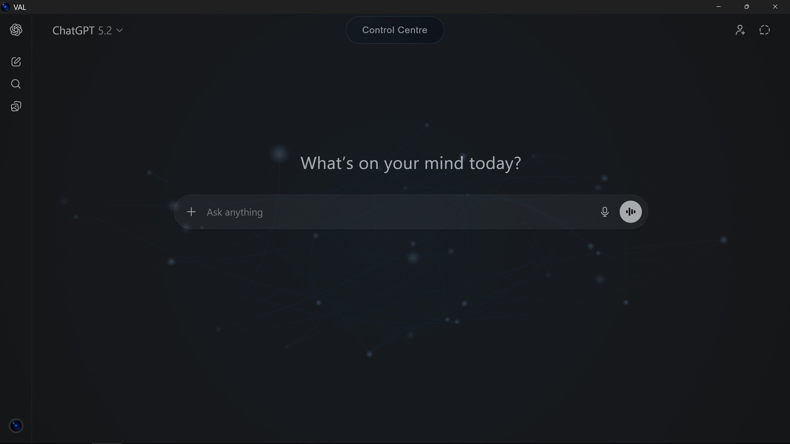
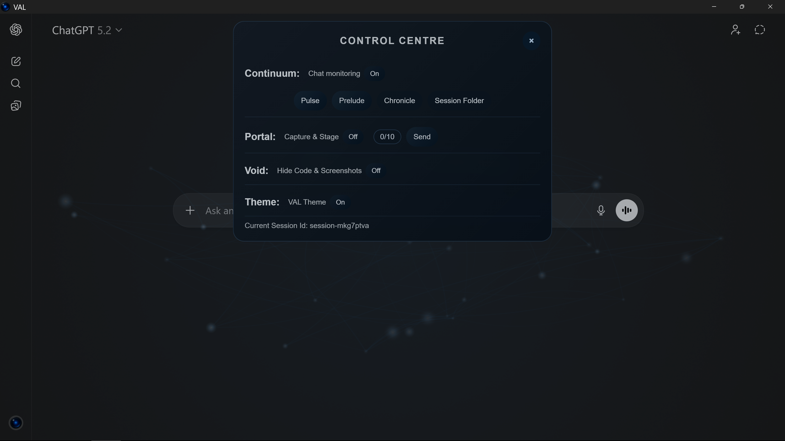

# VAL

**VAL** is a locally run Windows UI layer for **ChatGPT.com**, built with **.NET (WPF)** and Microsoft’s **WebView2 (Edge/Chromium)** runtime.

VAL is designed to improve how people *work with* AI assistants by providing a stable, user-controlled environment with explicit modules for continuity, organization, capture workflows, and context management.

VAL does **not** automate behavior.
It does **not** “act on your behalf.”
Everything is **user-invoked**, and all state remains **local**.

---

## Screenshots

> These screenshots show the Control Centre and overall UI experience.

| Control Centre | Main UI |
|---|---|
|  |  |

---

## What VAL is

- A **local, per-user Windows application** that hosts ChatGPT.com using WebView2
- A **controlled UI environment** for explicit, user-invoked modules
- A tool focused on **continuity, context stability, and workflow polish**
- A system designed to be **predictable** and **non-creepy by default**

---

## What VAL is not

- No telemetry
- No cloud backend
- No background automation
- No autonomous agents
- No silent “memory mining”
- No data collection beyond what you explicitly initiate

---

## Modules

VAL is built around **explicit, user-invoked modules**.
Modules do **nothing** unless you enable them or trigger their actions.

### Continuum (Continuity)
Continuum preserves long-running work across sessions and chats.

- Captures structured conversation history locally (`Truth.log`)
- Produces clean **handoff context** using `Pulse / Prelude / Chronicle`
- Helps keep deep sessions stable even when chat UI history becomes too large

### Portal (Capture & Stage)
Portal provides a stable **capture → stage → send** workflow for external content.

- Designed for frictionless screenshot capture and staging
- User controls exactly what gets staged and when it is sent
- Resettable buffer (no hidden persistence unless you choose it)

### Void (Noise Suppression)
Void reduces visual flood in the chat UI.

- Hides rendered **code blocks** and **pasted screenshots**
- Intended to keep signal readable and the DOM light
- Display-layer only (no content mutation)

### Theme (Visual Layer)
Theme controls presentation only.

- No behavior changes
- Safe to toggle at any time

---

## Design principles

VAL follows a single unifying rule:

**VAL never acts unless the user explicitly asks it to.**

Additional principles:

- User-invoked by default
- No background automation
- Local-first state
- Predictable, modular behavior
- No cross-module side effects

---

## Installation

Download the installer from the **Releases** section and run it.

- Installs per-user to: `%LOCALAPPDATA%\VAL`
- No administrator rights required (unless you choose an all-users install)

> **Note:** VAL requires the Microsoft Edge **WebView2 Runtime**.  
> On most Windows systems it is already installed. If not, Windows will prompt to install it.

> **Note:** VAL is currently **unsigned**.  
> Windows may display an **“Unknown publisher”** warning on first run.

---

## Uninstall

VAL can be removed normally via:

**Windows Settings → Apps → Installed apps**

---

## Project status

VAL **v4.0+** is the first stable public release.

This project is intentionally focused and opinionated. Feedback is welcome, but changes are made selectively to preserve the design philosophy.

---

## Support

If you find VAL useful and want to support development, you can leave an optional tip here:

[ko-fi.com/valv4](https://ko-fi.com/valv4)
